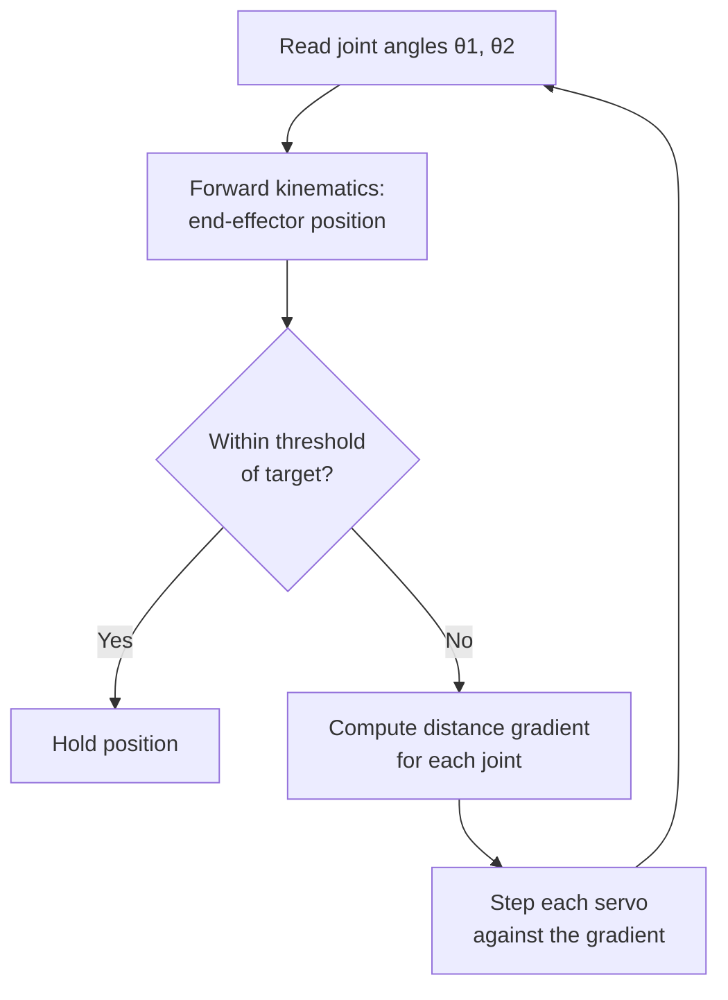

# roboArm

Firmware for a **3-DOF robotic arm**: a 360° base pivot plus a two-link arm that reaches within the plane the base is facing. Rather than solving the inverse-kinematics equations in closed form, the firmware treats "reach the target" as an optimization problem and walks the joint angles downhill toward the solution using **gradient descent**.

> **Status — work in progress.** The two arm joints (planar reaching) are implemented and working. The **360° base pivot — the third DOF — is not yet driven by the firmware.** It's the most straightforward joint to add: the base angle follows directly from the horizontal direction to the target (`atan2`), turning the reachable space from a single plane into a full cylinder around the base.

## How it works

The implemented control loop solves the two-link arm for a target `(x, y)` in its plane. Each pass:

1. Reads the current joint angles from the two servos.
2. Computes where the end effector currently is (forward kinematics via rotation matrices).
3. Computes how the distance-to-target changes with respect to each joint angle (the gradient).
4. Steps each joint a small amount in the direction that reduces that distance.

Because step 4 runs inside the Arduino `loop()`, every iteration performs one gradient-descent step and the arm converges over successive passes until the end effector is within a set threshold of the target. Once the base pivot is added, it simply rotates this plane to face the target first.

## Hardware

- Arduino-compatible board
- **3 servos** — a base-pivot servo (yaw) plus one per arm joint. The firmware currently drives the two arm-joint servos; the base servo is planned.
- A two-segment arm linkage (equal link lengths in the model)

## Tech stack

- **C++ / Arduino**
- **Servo** library for servo PWM control
- Serial output at 9600 baud for live debugging of angles, gradient, and position

## Files

| File | Role |
|---|---|
| `test/test.ino` | Main controller: forward kinematics, distance gradient (`findSlopes`), workspace clamping (`getBoundedTarget`), and the descent loop |
| `zero/zero.ino` | Homing sketch that drives the servos to a known start pose |

## Notes

- The target point is set in code (`target[]`) and is automatically clamped to the arm's reachable workspace.
- Link lengths are modeled as equal; tune `armlen` and the step size (`0.04`) to adjust reach and convergence speed.
